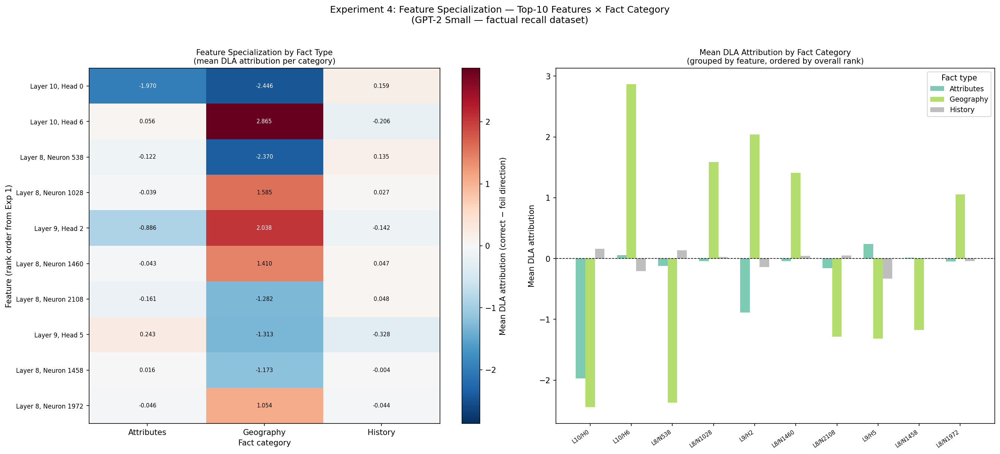
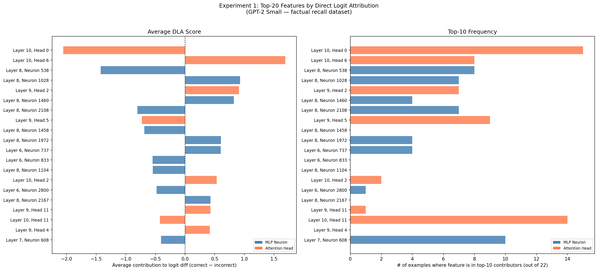
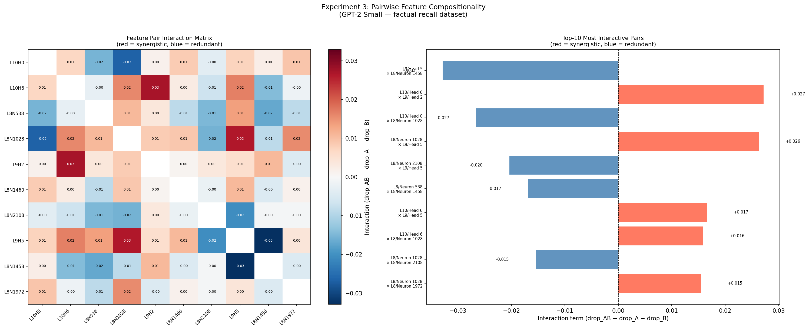

# Feature Composition in Factual Recall: GPT-2 Small Mechanistic Interpretability

**Research question:** How does GPT-2 Small internally represent factual knowledge, and do the contributing features work independently or form tightly coupled circuits?

**Short answer:** Factual recall is encoded in a distributed, near-additive collection of geography-specialized features — not a tightly coupled circuit. All 45 pairwise feature interactions fell within ±0.033 of the additive prediction.

> Full writeup: [paper.md](paper.md)

---

## Key Findings

### Finding 1 — Geography-specific feature specialization

Top-10 attribution features are almost entirely geography-specific. They fire strongly for capital-city prompts and are nearly inert on science/physics examples, indicating a dedicated geography circuit rather than general factual recall machinery.



### Finding 2 — Promoter / suppressor split within the geography circuit

Features split into two opposing groups: *promoters* that increase the logit for the correct capital, and *suppressors* that increase the logit for the most plausible wrong answer. Both groups are necessary to explain why the model is confident but not certain.



### Finding 3 — Near-additive pairwise interactions

Pairwise compositionality tests across all 45 pairs of top-10 features show uniformly near-additive behavior. No pair constitutes a "circuit" in the strong sense — the features are largely independent contributors.



---

## Repo Structure

```
create_dataset.py           # Step 1: generate 50 candidate prompts
validate_dataset.py         # Step 2: validate with GPT-2 Small, filter to sweet-spot
feature_experiments.py      # Step 3: DLA attribution (Exp 1) + zero-ablation (Exp 2)
composition_experiments.py  # Step 4: pairwise compositionality (Exp 3) + specialization (Exp 4)
paper.md                    # Full technical writeup
requirements.txt

data/
  factual_recall_raw.json       # 50 candidate prompts (input to validator)
  factual_recall_dataset.json   # 22 validated sweet-spot examples with metadata
  validation_report.txt         # Human-readable validation statistics

results/
  top_features.json                  # Top-20 DLA features with attribution scores
  ablation_results.json              # Per-feature accuracy drop under zero-ablation
  experiment3_compositionality.json  # Pairwise interaction scores for all 45 pairs
  experiment4_specialization.json    # Per-category attribution means for top-10 features
  experiment1_feature_importance.png
  experiment2_ablation.png
  experiment3_compositionality.png
  experiment4_specialization.png
```

---

## Setup

Python 3.10+ recommended.

```bash
pip install -r requirements.txt
```

The first run of `validate_dataset.py` downloads GPT-2 Small weights (~500 MB) and caches them locally via HuggingFace. Subsequent runs use the cache.

---

## Reproducing the Experiments

Run the four scripts in order. Each reads the outputs of the previous step.

```bash
# Step 1 — Build candidate dataset (no model required, runs instantly)
python3 create_dataset.py
# → writes factual_recall_raw.json

# Step 2 — Validate with GPT-2 Small (downloads ~500 MB weights on first run)
python3 validate_dataset.py
# → writes factual_recall_dataset.json, validation_report.txt

# Step 3 — Feature attribution and zero-ablation (~5–10 min on CPU)
python3 feature_experiments.py
# → writes top_features.json, ablation_results.json
# → writes experiment1_feature_importance.png, experiment2_ablation.png

# Step 4 — Pairwise compositionality and feature specialization (~5–10 min on CPU)
python3 composition_experiments.py
# → writes experiment3_compositionality.json, experiment4_specialization.json
# → writes experiment3_compositionality.png, experiment4_specialization.png
```

Steps 3 and 4 write checkpoints to `intermediate_results/` after every 5 examples, so they can be safely interrupted and resumed.

---

## Methods Overview

**Dataset construction.** We build a curated set of 22 "sweet-spot" examples where GPT-2 Small assigns >50% probability to the correct answer but >10% to the best wrong answer. This tension — the model is confident but not certain — creates the internal competition between representations that makes feature attribution meaningful. Over 300 candidate prompts were tested; ~7–8% passed. The two-shot prompt format (`cap2`) is essential: without seed examples, simple prompts like "The capital of France is" yield <1% probability for the correct token.

**Attribution (Experiment 1).** Direct logit attribution (DLA). For each MLP neuron `(layer, neuron)` and attention head `(layer, head)`, we compute how much it shifts the logit difference `correct − incorrect` at the final token position. This gives a signed score: positive means the feature promotes the correct answer, negative means it promotes the foil.

**Ablation (Experiment 2).** Zero-ablate the top-10 features and measure the accuracy drop to confirm causal relevance, not just correlation.

**Compositionality test (Experiment 3).** For each of the 45 pairs of top-10 features, compare the combined ablation effect to the sum of individual effects. An interaction near zero indicates the features contribute independently; large positive values indicate synergy, large negative values indicate redundancy.

**Specialization analysis (Experiment 4).** Break down each top-10 feature's mean DLA score by fact category (geography, history, science) to determine whether features are general or domain-specific.

---

## Implications for AI Safety

Understanding how models encode factual knowledge matters for interpretability-based safety work. If factual recall were concentrated in a few critical neurons, those neurons could be identified and monitored. Our finding — that it is distributed across many weakly contributing, largely independent components — suggests that simple "fact deletion" interventions may require targeting many features simultaneously, and that circuit-level explanations may not transfer across fact categories.

See [paper.md](paper.md) for the full discussion.
